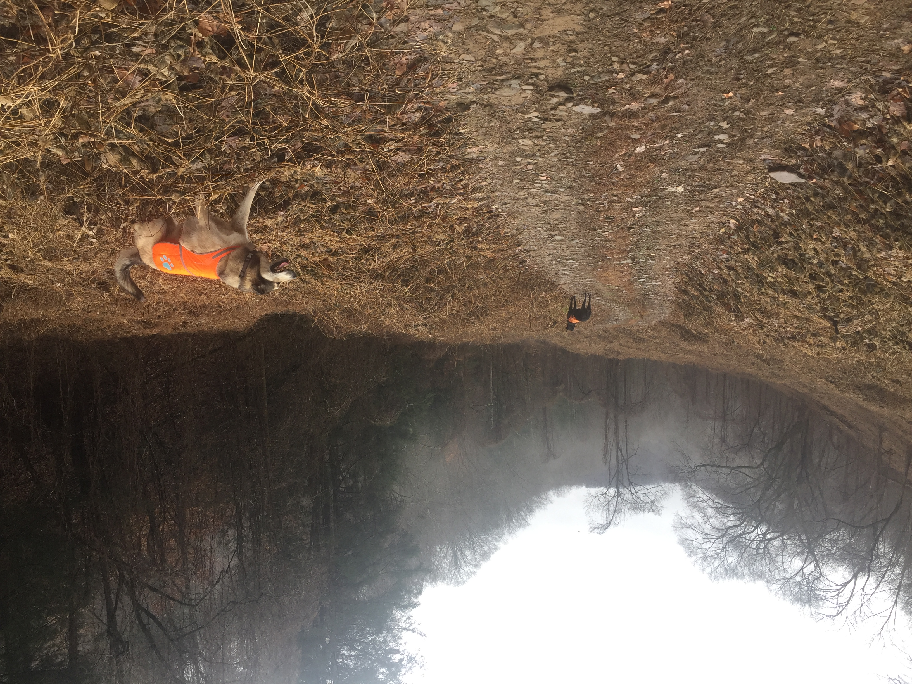

# Welcome To VSP

this is the readme

now that I've added some new subfolders, let's see if we can get them to show up in GitBook.

Weird that this image came through upside down but ok ... what's going to happen when I save this? Will it be able to sync with GitHub?

Yes it did!

Okay, here is a new line added in GitBook. I have saved it.

And here is a new line that I will commit to master in GitHub.

