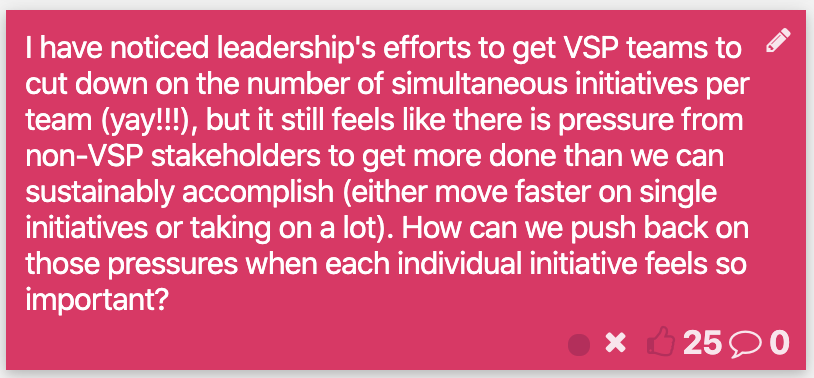

# Rachael's New Baby Page

## Heading One Hi Friends!

| Priority | Level of Effort | Name of initiative |
| :--- | :--- | :--- |
| 12 | 2 | HAHAHA |
| 2 | 15 | babababa |



```text
<a href="http://www.rachael.gov">Hi I'm Rachael</a>
```

1. Howdy
2. Doody


this is a scary thing [hello](https://app.gitbook.com/@content-ia/s/another-test-mk/~/drafts/-M5h0XyJ6cN7xNrgLRJs/rachaels-new-page)


























```

```





